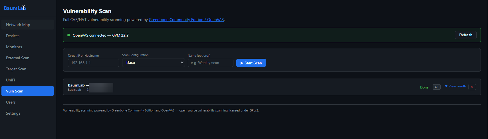

# BaumLab

A self-hosted home lab monitoring, mapping, and security dashboard. Discover everything on your network, watch service health in real time, scan for open ports and vulnerabilities, and pull live data from your UniFi controller — all in one dark-themed web UI.



---

## Features

### Network Discovery
- **nmap-based scanning** — ARP host discovery across one or more CIDR ranges
- **Automatic device classification** — heuristic typing by MAC vendor, open ports, and OS fingerprint (router, NAS, server, Raspberry Pi, Apple device, etc.)
- **Live scan log** — scrolling output streamed to the UI while a scan runs
- **Device management** — edit labels, device type, VLAN tag, and notes per device; delete stale entries

### Network Map
- **Interactive topology diagram** (ReactFlow) showing gateways → switches/APs → clients
- **VLAN colour coding** — up to 6 colours distinguish network segments at a glance
- **UniFi enrichment** — overlays UniFi client/device data (signal strength, model) onto discovered hosts

### Service Monitors
- **Continuous health checks** — ICMP ping, raw TCP connect, HTTP/HTTPS status checks
- **Per-target intervals** — configure each monitor independently (seconds granularity)
- **Live results** — latency, status code, up/down history
- **Overall status roll-up** — Operational / Degraded / Outage / Unknown
- **Public status page** — unauthenticated read-only view embeddable in dashboards (e.g. BaumDash Status tab)

### Port Scanning
- **Quick scan** — common, top-100, or top-1000 port presets
- **Deep scan** — nmap NSE scripts extract SSL certificates, TLS cipher suites, HTTP server headers and page titles, SMB security negotiation details
- **Per-device on-demand** — trigger a port scan from the Devices page for any host

### External Scanning
- **Public IP detection** — fetch the server's external IP
- **Port probe** — socket-based scan of 20 common ports (FTP, SSH, HTTP, HTTPS, RDP, VNC, MySQL, etc.) against any external host
- **DNS lookup** — resolve any domain to all IPv4 and IPv6 addresses

### Vulnerability Scanning (OpenVAS)
- **Greenbone Community Edition** bundled as a Docker service — no separate install
- **Scan task management** — create, launch, monitor progress, view results, delete tasks
- **CVSS-rated findings** — colour-coded severity badges (Critical / High / Medium / Low / Log)
- **Scan configuration picker** — choose from all configs available in your OpenVAS instance
- Connects via GMP Unix socket or TLS/TCP

### UniFi Integration
- **Clients** — connected WiFi and LAN clients with IP, MAC, VLAN, signal strength (dBm), TX/RX bytes
- **Devices** — APs, switches, gateways with model, uptime, CPU, memory
- **Networks** — configured VLANs and network segments
- **Switch port stats** — per-port traffic on managed switches
- Supports both **classic UniFi Controller** and **UniFi Dream Machine / UDM Pro** (API key or username/password auth)

### Authentication & Users
- **JWT login** with configurable token expiry
- **TOTP two-factor authentication** — QR code setup, per-user enable/disable
- **Role-based access** — admin and standard user roles
- **User management** — create, edit, delete users (admin only); each user manages their own MFA
- Auto-creates an initial admin account on first startup

### Settings
- **UniFi** — URL, credentials, site, controller type, SSL verification; test connection button
- **Scan** — default CIDR ranges, auto-scan toggle and interval
- **OpenVAS** — socket path or host/port, credentials; test connection button

---

## Stack

| Layer | Tech |
|-------|------|
| API | FastAPI + SQLModel (SQLite) |
| Scheduler | APScheduler |
| Discovery | python-nmap + mac-vendor-lookup |
| Monitoring | icmplib + httpx |
| Vuln scanning | Greenbone OpenVAS (GMP protocol) |
| Frontend | React 18 + Vite + ReactFlow + Zustand |
| Auth | JWT + pyotp (TOTP 2FA) |
| Deploy | Docker + Compose |

---

## Quick Start

```bash
git clone https://github.com/Bruiserbaum/BaumLab.git
cd BaumLab

# Set required environment variables
cp .env.example .env
# Edit .env — set SECRET_KEY, ADMIN_PASSWORD, and OPENVAS_ADMIN_PASSWORD

# Copy and edit config
cp config/config.yaml.example config/config.yaml
# Edit config.yaml — set your scan ranges and (optionally) UniFi credentials

docker compose up -d
```

| Service | URL |
|---------|-----|
| Dashboard | http://localhost:3100 |
| API docs | http://localhost:8100/docs |
| OpenVAS UI | http://localhost:9392 |

> **First run:** OpenVAS takes 15–60 minutes to sync its vulnerability feed before scans can run.

---

## Configuration

### Environment Variables (`.env`)

| Variable | Default | Description |
|----------|---------|-------------|
| `SECRET_KEY` | — | **Required.** JWT signing key — generate with `openssl rand -hex 32` |
| `ADMIN_USERNAME` | `admin` | Initial admin username |
| `ADMIN_PASSWORD` | — | **Required.** Initial admin password |
| `TOKEN_EXPIRE_HOURS` | `8` | JWT token lifetime |
| `API_PORT` | `8100` | API container port |
| `UI_PORT` | `3100` | Frontend container port |
| `OPENVAS_ADMIN_USERNAME` | `admin` | OpenVAS admin user |
| `OPENVAS_ADMIN_PASSWORD` | `changeme` | **Change this.** OpenVAS admin password |
| `OPENVAS_PORT` | `9392` | Greenbone Security Assistant port |
| `OIDC_ENABLED` | `false` | Set to `true` to enable Authentik SSO login |
| `OIDC_ISSUER` | — | Authentik provider URL — `https://auth.yourdomain.com/application/o/<app-slug>/` |
| `OIDC_CLIENT_ID` | — | OAuth2 client ID from Authentik |
| `OIDC_CLIENT_SECRET` | — | OAuth2 client secret from Authentik |
| `OIDC_REDIRECT_URI` | — | Full callback URL — `http://your-server:8100/api/auth/oidc/callback` |
| `OIDC_FRONTEND_URL` | *(empty)* | Only needed when API and frontend are on different ports with no shared proxy |

### `config/config.yaml`

```yaml
scan:
  default_ranges:
    - "192.168.1.0/24"
  auto_interval_minutes: 60

unifi:
  url: "https://192.168.1.1"   # Leave blank to disable
  username: "admin"
  password: "changeme"
  site: "default"
  verify_ssl: false
  controller_type: "udm"        # "classic" or "udm"

monitor:
  default_interval_seconds: 60
```

All UniFi and OpenVAS settings can also be changed at runtime from the Settings page without editing files.

---

## Authentik SSO (Optional)

BaumLab supports OIDC login via Authentik. When enabled, a **Login with Authentik** button appears on the login page alongside the standard username/password form. Both methods coexist — existing local accounts are unaffected.

### Setup

1. In Authentik, create an **OAuth2/OpenID Provider** and an **Application** for it.
2. Set the redirect URI to: `http://your-server:8100/api/auth/oidc/callback`
   (or `https://baumlab.yourdomain.com/api/auth/oidc/callback` if behind a reverse proxy)
3. Set the OIDC env vars in `.env` and uncomment them in `docker-compose.yml`.
4. Rebuild and restart: `docker compose up -d --build`

First-time SSO users get a local account created automatically. OIDC users cannot log in with a password — their account is linked to the Authentik subject ID.

---

## Network Scanning Notes

For ARP-based discovery and raw ICMP ping, the API container needs elevated network capabilities. These are already set in `docker-compose.yml`:

```yaml
cap_add:
  - NET_ADMIN
  - NET_RAW
```

For full ARP scanning on Linux hosts, switch the API to host networking:

```yaml
network_mode: host
```

Then restart: `docker compose up -d api`

> `network_mode: host` is Linux-only. On Windows/Mac, scanning is limited to what the bridge network can reach.

---

## API

Full interactive docs available at `http://localhost:8100/docs` when running.

| Endpoint group | Description |
|---------------|-------------|
| `POST /api/auth/login` | Authenticate (returns token or MFA challenge) |
| `GET /api/devices` | List all discovered devices |
| `POST /api/scan/network` | Start a background network discovery scan |
| `POST /api/scan/ports/{id}` | Deep port scan a specific device |
| `GET /api/monitors` | List service monitors |
| `GET /api/status/public` | Public monitor status (no auth) |
| `POST /api/advanced-scan/start` | Advanced NSE port scan |
| `GET /api/external-scan/ip` | Get server's public IP |
| `POST /api/external-scan/ports` | Probe external ports |
| `GET /api/unifi/clients` | UniFi connected clients |
| `GET /api/unifi/devices` | UniFi network devices |
| `GET /api/vuln-scan/tasks` | List OpenVAS scan tasks |
| `POST /api/vuln-scan/start` | Launch a vulnerability scan |
| `GET /api/settings` | Get current settings (admin) |
| `GET /api/users` | User management (admin) |

---

## BaumLab Suite
**[Download BaumLab Suite](https://github.com/Bruiserbaum/BaumLab/releases/latest)** ΓÇö a single Windows installer that installs and keeps all BaumLab apps up to date.
BaumLab Suite checks GitHub for the latest release of each app, detects what you already have installed via the Windows registry, and silently installs or updates your selection ΓÇö no wizard windows, no manual downloads.
### Apps included
| App | Description |
|-----|-------------|
| [BaumDash](https://github.com/Bruiserbaum/BaumDash) | Ultrawide desktop dashboard ΓÇö audio mixer, media controls, Discord voice, system stats |
| [BaumLaunch](https://github.com/Bruiserbaum/BaumLaunch) | WinGet GUI package manager with system tray updater and curated app catalog |
| [BaumAdminTool](https://github.com/Bruiserbaum/BaumAdminTool) | Windows admin utility ΓÇö system overview, process monitor, RoboCopy backup, event logs |
| [BaumSecure](https://github.com/Bruiserbaum/BaumSecure) | Homelab security analyzer ΓÇö scans your external attack surface and flags misconfigurations |
| [BaumScriptCodex](https://github.com/Bruiserbaum/BaumScriptCodex) | Script library for IT admins ΓÇö store, search, tag, and copy PowerShell/Bash/Batch scripts |
| [BaumKeyGenerator](https://github.com/Bruiserbaum/BaumKeyGenerator) | Secret key generator ΓÇö hex, base64, JWT, database passwords, Vaultwarden Argon2 tokens |
### How it works
1. Launch BaumLab Suite ΓÇö it queries the GitHub releases API for each app in parallel
2. Installed versions are detected from the Windows registry (Inno Setup uninstall entries)
3. Apps with available updates are highlighted in amber
4. Check the apps you want, then click **Install / Update Selected**
5. Each installer runs silently in the background ΓÇö progress and status shown in real time
**Requirements:** Windows 10 21H1 or later, x64. No .NET runtime required (self-contained).
Source: [BaumLabSuite/](BaumLabSuite/)
---
## Related Projects
- [BaumLab Suite](https://github.com/Bruiserbaum/BaumLab/releases/latest) ΓÇö One-click installer and updater for all BaumLab apps (this repo)
- [BaumDash](https://github.com/Bruiserbaum/BaumDash) ΓÇö Desktop dashboard with audio mixer, Discord, media controls, and a Status tab that can embed the BaumLab public status page
- [BaumLaunch](https://github.com/Bruiserbaum/BaumLaunch) ΓÇö WinGet-based GUI package manager for Windows
- [BaumAdminTool](https://github.com/Bruiserbaum/BaumAdminTool) ΓÇö Portable dark-theme Windows admin utility
- [BaumDocker](https://github.com/Bruiserbaum/BaumDocker) ΓÇö Home lab Docker stack collection
- [BaumSecure](https://github.com/Bruiserbaum/BaumSecure) ΓÇö Windows home lab security analyzer
- [BaumScriptCodex](https://github.com/Bruiserbaum/BaumScriptCodex) ΓÇö Script library for IT admins
- [BaumKeyGenerator](https://github.com/Bruiserbaum/BaumKeyGenerator) ΓÇö Secret key and token generator---

## License and Project Status

This repository is a personal project shared publicly for learning, reference, portfolio, and experimentation purposes.

Development may include AI-assisted ideation, drafting, refactoring, or code generation. All code and content published here were reviewed, selected, and curated before release.

This project is licensed under the Apache License 2.0. See the LICENSE file for details.

Unless explicitly stated otherwise, this repository is provided as-is, without warranty, support obligation, or guarantee of suitability for production use.

Any third-party libraries, assets, icons, fonts, models, or dependencies used by this project remain subject to their own licenses and terms.